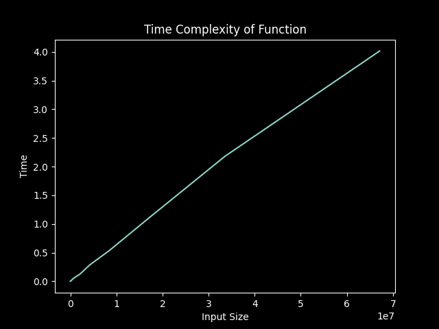
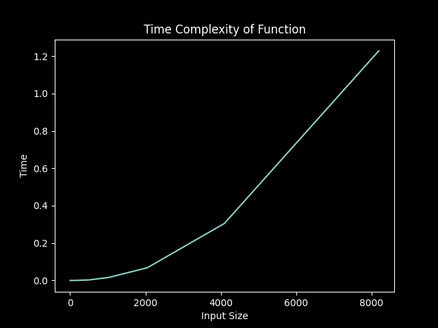

# COMPLEXIZER

### A Python Program to analyze and plot time complexity of a function.

<br>

**Function:**

```Python
''' O(N) '''
def sum_of_n_numbers(n):
    start_time = time.time()
    s = 0
    for i in range(1,n+1):
        s = s + i
    end_time = time.time()
    return s,end_time-start_time
```



<br>
<br>

**Function:**
```Python
''' O(N^2) '''
def my_func(n):
    start_time = time.time()
    s = 0
    for i in range(1,n+1):
        for y in range(1,i+1): 
            s = s + i
    end_time = time.time()
    return s,end_time-start_time
```

